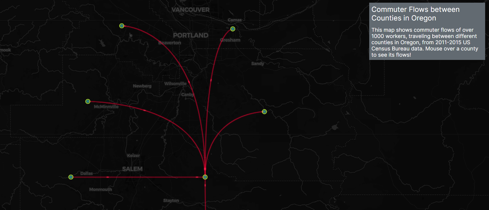

# Commuter Flows between Counties in Oregon #

 Link to map: https://ubc-geos472-spring2023.github.io/mayabeakhouse-web/lab-2/oregoncommuters.html

Collaborations and resources:  
I used this tutorial to help explain how to use the Leaflet Canvas Flowmap plugin: https://neiugis.github.io/lab6/  
I also looked at the Github repository for the plugin (https://github.com/jwasilgeo/Leaflet.Canvas-Flowmap-Layer). The animation and interaction sections of the README were especially useful.

Reflective analysis:  

